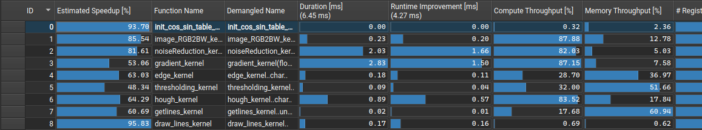
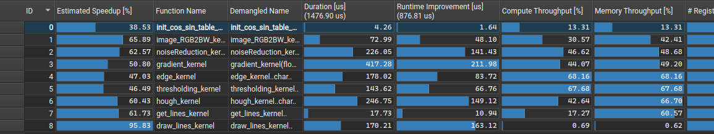

# lane-assist

> **Autora:** Yi (Laura) Wang Qiu

## Notas

Se ha modificado [main.cpp](main.cpp) de modo que se ha dividido por completo las funciones realizadas por la CPU y por la GPU en cada de sus funciones respectivas (lane_assist_CPU y lane_assist_GPU).

En la versión de GPU, se han creado kernels para cada función: `image_RGB2BW_kernel`, `init_cos_sin_table_kernel`, `canny_kernel`, `hough_kernel`, `getlines_kernel` y `draw_lines_kernel` 

Es importante destacar que debido al `printf` o mensaje de depuración en main.cpp que imprime el tiempo que se ha tardado en realizar todo el cómputo tanto de la CPU como de la GPU y las líneas detectadas, se ha añadido el tiempo de convertir la imagen de RGB a blanco y negro `image_RGB2BW`, de la inicialización de la tabla de senos y cosenos `init_cos_sen_table`, y del dibujado de las líneas sobre la imagen original `draw_lines` que en la versión original del código no estaban. Además, en la versión de GPU se deben traer de vuelta `x1`, `y1`, `x2`, `y2` y `nlines` de vuelta a la CPU para únicamente eso.

En la reserva de memoria para pasar una imagen en color (RGB) a una imagen en escala de grises (BW) para la GPU con `cudaMalloc` se debe especificar que necesita un tamaño de 3 * width * height bytes por los tres componentes de color donde cada píxel ocupa 3 bytes.

## [Versión 1](lane-assist.v1/routinesGPU.cu)

Se ha descompuesto `canny_kernel` en diferentes kernels: `noiseReduction_kernel`, `gradient_kernel`, `edge_kernel` y `thresholding_kernel`, y se ha usado 16 como tamaño de bloque. Esto continua siendo así en la siguiente versión.

Se usa `cudaMalloc`, `cudaMemcpy` y `cudaFree` en vez de `cudaMallocManaged` porque se ha separado la funcionalidad entre CPU y GPU.

## [Versión 2](lane-assist.v2/routinesGPU.cu)

En esta segunda versión, realizamos un perfilado sobre el código de la versión 1. Los detalles se encuentran en [profile](lane-assist.v1/profiling/details.pdf) y al realizar `nvprof ./image img0.png g` obtenemos el archivo [nvprof](lane-assist.v1/profiling/nvprof.txt).

Iremos realizando mejoras en los distintos kernels para mejorar el rendimiento de la aplicación.

### init_cos_sin_table_kernel

1. En el resumen de [init_cos_sin_table_kernel](lane-assist.v1/profiling/initCosSinTableKernelSummary.pdf) se especificaba la falta de ocupación de los registros de la GPU:

    ```
    Achieved Occupancy
    Est. Speedup: 93.70%

    The difference between calculated theoretical (50.0%) and measured achieved occupancy (3.1%) can be the result of warp scheduling overheads or workload imbalances during the kernel execution. Load imbalances can occur between warps within a block as well as across blocks of the same kernel. See the  CUDA Best Practices Guide for more details on optimizing occupancy.
    ```

    Es por ello que se ha cambiado el tamaño de bloque a 256, un número múltiplo de 32.

2. En [init_cos_sin_table_kernel_1](lane-assist.v2/profiling/initCosSinTableKernel_1.pdf) ahora especifica que el grid es pequeño:

    ```
    Small Grid
    Est. Speedup: 95.83%

    The grid for this launch is configured to execute only 1 block, which is less than the GPU's 24 multiprocessors. This can underutilize some multiprocessors. If you do not intend to execute this kernel concurrently with other workloads, consider reducing the block size to have at least one block per multiprocessor or increase the size of the grid to fully utilize the available hardware resources. See the  Hardware Model description for more details on launch configurations.
    ```

    Es por ello que se ha cambiado a un grid 2D y cambiando el tamaño de bloque a 672 (sigue siendo múltiplo de 32) e implementado la versión 2D de `init_cos_sin_table_kernel` pudiendo conseguir un mayor rendimiento y un menor _est. speedup_. Ver en [init_cos_sin_table_kernel_2](lane-assist.v2/profiling/initCosSinTableKernel_2.pdf).

### image_RGB2BW_kernel

1. En el resumen de [image_RGB2BW_kernel](lane-assist.v1/profiling/imageRGB2BWKernelSummary.pdf) se especificaba el gran uso de las operaciones en punto flotante de doble precisión (FP64) frente a las de precisión simple (FP32):

    ```
    FP64/32 Utilization
    Est. Speedup: 85.54%

    The ratio of peak float (fp32) to double (fp64) performance on this device is 32:1. The workload achieved 0% of this device's fp32 peak performance and 31% of its fp64 peak performance. If  Compute Workload Analysis determines that this workload is fp64 bound, consider using 32-bit precision floating point operations to improve its performance. See the  Kernel Profiling Guide for more details on roofline analysis.
    ```

    Es por ello que se ha cambiado todos los valores de `image_out[i * width + j] = (uint8_t)(0.2989 * R + 0.5870 * G + 0.1140 * B);` a precisión simple añadiendo un sufijo `f` a los valores: `image_out[i * width + j] = (uint8_t)(0.2989f * R + 0.5870f * G + 0.1140f * B);`

2. En [image_RGB2BW_kernel_1](lane-assist.v2/profiling/imageRGB2BWKernel_1.pdf) se especificaba que un acceso no coalescente:

    ```
    Uncoalesced Global Accesses
    Est. Speedup: 65.87%

    This kernel has uncoalesced global accesses resulting in a total of 648000 excessive sectors (71% of the total 907200 sectors). Check the L2 Theoretical Sectors Global Excessive table for the primary source locations. The  CUDA Programming Guide has additional information on reducing uncoalesced device memory accesses.
    ```

> Con memoria compartida y accesos coalescentes no se ha conseguido mejorar el rendimiento.

### noiseReduction_kernel

1. En el resumen de [noiseReduction_kernel](lane-assist.v1/profiling/noiseReductionKernelSummary.pdf) se especificaba el gran uso de las operaciones en punto flotante de doble precisión (FP64) frente a las de precisión simple (FP32):

    ```
    FP64/32 Utilization
    Est. Speedup: 81.61%

    The ratio of peak float (fp32) to double (fp64) performance on this device is 32:1. The workload achieved close to 0% of this device's fp32 peak performance and 44% of its fp64 peak performance. If  Compute Workload Analysis determines that this workload is fp64 bound, consider using 32-bit precision floating point operations to improve its performance. See the  Kernel Profiling Guide for more details on roofline analysis.
    ```

    Es por ello que se ha cambiado todos los valores de la matriz de convolución a precisión simple añadiendo un sufijo `f` a los valores obteniendo [noiseReduction_kernel_1](lane-assist.v2/profiling/noiseReductionKernel_1.pdf).

### gradient_kernel

1. Asimismo como en `noiseReduction_kernel`, en el resumen de [gradient_kernel](lane-assist.v1/profiling/gradientKernelSummary.pdf) se ha cambiado todos los valores de la matriz de convolución a precisión simple añadiendo un sufijo `f` a los valores y creado una variable local (phi_value) para su posterior asignación a `phi[i * width + j]` obteniendo [gradient_kernel_1](lane-assist.v2/profiling/gradientKernel_1.pdf) (no hay mejora apreciable).

### edge_kernel

1. En el resumen de [edge_kernel](lane-assist.v1/profiling/edgeKernelSummary.pdf) se especificaba:

    ```
    Long Scoreboard Stalls
    Est. Speedup: 63.03%

    On average, each warp of this workload spends 30.0 cycles being stalled waiting for a scoreboard dependency on a L1TEX (local, global, surface, texture) operation. Find the instruction producing the data being waited upon to identify the culprit. To reduce the number of cycles waiting on L1TEX data accesses verify the memory access patterns are optimal for the target architecture, attempt to increase cache hit rates by increasing data locality (coalescing), or by changing the cache configuration. Consider moving frequently used data to shared memory. This stall type represents about 81.5% of the total average of 36.8 cycles between issuing two instructions.

    Uncoalesced Global Accesses
    Est. Speedup: 39.40%

    This kernel has uncoalesced global accesses resulting in a total of 909824 excessive sectors (41% of the total 2241606 sectors). Check the L2 Theoretical Sectors Global Excessive table for the primary source locations. The  CUDA Programming Guide has additional information on reducing uncoalesced device memory accesses.
    ```

    Se ha aplicado memoria compartida con padding para mejorar el rendimiento de este kernel. Además, la asignación de `pedge` en cada `if` del código se ha evitado creando una variable local `edge_value` y asignando el valor de `pedge` a esta variable al final de todos los `if`s obteniendo [edge_kernel_1](lane-assist.v2/profiling/edgeKernel_1.pdf).

### thresholding_kernel

1. En el resumen de [thresholding_kernel](lane-assist.v1/profiling/thresholdingKernelSummary.pdf) se especificaba:

    ```
    Long Scoreboard Stalls
    Est. Speedup: 48.34%

    On average, each warp of this workload spends 18.3 cycles being stalled waiting for a scoreboard dependency on a L1TEX (local, global, surface, texture) operation. Find the instruction producing the data being waited upon to identify the culprit. To reduce the number of cycles waiting on L1TEX data accesses verify the memory access patterns are optimal for the target architecture, attempt to increase cache hit rates by increasing data locality (coalescing), or by changing the cache configuration. Consider moving frequently used data to shared memory. This stall type represents about 75.9% of the total average of 24.1 cycles between issuing two instructions.

    Achieved Occupancy
    Est. Speedup: 28.81%

    The difference between calculated theoretical (100.0%) and measured achieved occupancy (71.2%) can be the result of warp scheduling overheads or workload imbalances during the kernel execution. Load imbalances can occur between warps within a block as well as across blocks of the same kernel. See the  CUDA Best Practices Guide for more details on optimizing occupancy.

    Uncoalesced Global Accesses
    Est. Speedup: 27.60%

    This kernel has uncoalesced global accesses resulting in a total of 179382 excessive sectors (29% of the total 622557 sectors). Check the L2 Theoretical Sectors Global Excessive table for the primary source locations. The  CUDA Programming Guide has additional information on reducing uncoalesced device memory accesses.
    ```

    Se ha añadido el uso de memoria compartida con padding para mejorar el rendimiento de este kernel. Además, se ha creado una variable local `image_out_value` para asignar el valor de `image_out` a esta variable al final del `if-else` obteniendo [thresholding_kernel_1](lane-assist.v2/profiling/thresholdingKernel_1.pdf) (no hay mejora apreciable).

### hough_kernel

1. En el resumen de [hough_kernel](lane-assist.v1/profiling/houghKernelSummary.pdf) se especificaba:

    ```
    Thread Divergence
    Est. Speedup: 64.29%

    Instructions are executed in warps, which are groups of 32 threads. Optimal instruction throughput is achieved if all 32 threads of a warp execute the same instruction. The chosen launch configuration, early thread completion, and divergent flow control can significantly lower the number of active threads in a warp per cycle. This workload achieves an average of 7.6 threads being active per cycle. This is further reduced to 7.4 threads per warp due to predication. The compiler may use predication to avoid an actual branch. Instead, all instructions are scheduled, but a per-thread condition code or predicate controls which threads execute the instructions. Try to avoid different execution paths within a warp when possible.

    FP64 Non-Fused Instructions
    Est. Speedup: 43.34%

    This kernel executes 0 fused and 529020 non-fused FP64 instructions. By converting pairs of non-fused instructions to their  fused, higher-throughput equivalent, the achieved FP64 performance could be increased by up to 50% (relative to its current performance). Check the Source page to identify where this kernel executes FP64 instructions.

    Uncoalesced Global Accesses
    Est. Speedup: 40.17%

    This kernel has uncoalesced global accesses resulting in a total of 1230354 excessive sectors (42% of the total 2959749 sectors). Check the L2 Theoretical Sectors Global Excessive table for the primary source locations. The  CUDA Programming Guide has additional information on reducing uncoalesced device memory accesses.
    ```

    Se ha modificado `round` a `roundf` para aprovechar al máximo la precisión simple. Luego, se ha comprobado que `(int)(roundf(rho + hough_h))` no se saliese de los límites de `accumulators` obteniendo [hough_kernel_1](lane-assist.v2/profiling/houghKernel_1.pdf) (no hay mejora apreciable).

### get_lines_kernel

1. En el resumen de [get_lines_kernel](lane-assist.v1/profiling/getlinesKernelSummary.pdf) se especificaba:

    ```
    Uncoalesced Global Accesses
    Est. Speedup: 60.69%

    This kernel has uncoalesced global accesses resulting in a total of 183240 excessive sectors (75% of the total 244614 sectors). Check the L2 Theoretical Sectors Global Excessive table for the primary source locations. The  CUDA Programming Guide has additional information on reducing uncoalesced device memory accesses.

    DRAM Global Store Access Pattern
    Est. Speedup: 53.32%

    The memory access pattern for global stores to DRAM might not be optimal. On average, only 4.0 of the 32 bytes transmitted per sector are utilized by each thread. This applies to the 0.0% of sectors missed in L2. This could possibly be caused by a stride between threads. Check the  Source Counters section for uncoalesced global stores.

    L1TEX Global Load Access Pattern
    Est. Speedup: 41.25%

    The memory access pattern for global loads from L1TEX might not be optimal. On average, only 8.0 of the 32 bytes transmitted per sector are utilized by each thread. This could possibly be caused by a stride between threads. Check the  Source Counters section for uncoalesced global loads.
    ```

> ¿Se puede mejorar? No se ha conseguido mejorar el rendimiento aplicando memoria compartida con padding.

### draw_lines_kernel

1. En [draw_lines_kernel](lane-assist.v1/profiling/drawLinesKernelSummary.pdf) se especificaba que el grid era pequeño:

    ```
    Small Grid
    Est. Speedup: 95.83%

    The grid for this launch is configured to execute only 1 block, which is less than the GPU's 24 multiprocessors. This can underutilize some multiprocessors. If you do not intend to execute this kernel concurrently with other workloads, consider reducing the block size to have at least one block per multiprocessor or increase the size of the grid to fully utilize the available hardware resources. See the  Hardware Model description for more details on launch configurations.
    ```

> ¿Se puede mejorar? No se ha conseguido mejorar el rendimiento.

## Comparación entre versión 1 y versión 2

| **Antes (v1)** |
|---|
|  |
| **Después (v2)** |
|  |
